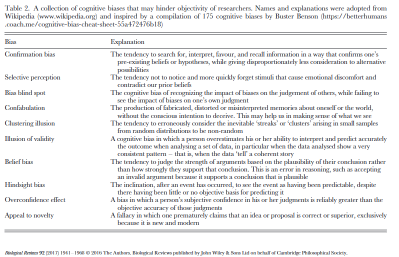

#### Study Design

Reproducible experiments start with rigorous design:  
(1) The sample size should be large enough to detect the predicted effect.  
(2) Samples should be assigned to different treatments randomly such that confounding effects of biological or procedural variation are minimized.  
(3) Data should be collected and analysed in such a way that researcher bias does not influence the outcome (especially if data collection is subjective).  

**In this class we will discuss different types of bias, how they impact reproducibility and how to mitigate such effects.  We will also focus discuss how to determine an appropriate sample size**  

_Before we meet please take a look at the material below on bias in research_

* [Catalog of Bias](https://catalogofbias.org/) Look up one or two types of bias from the list below and think about how these could be influencing your experiments  
   * [Data dredging bias](https://catalogofbias.org/biases/data-dredging-bias/)  _this is related to the p-hacking we talked about last time_
  ** [Detection bias](https://catalogofbias.org/biases/detection-bias/)  
  ** [Hot Stuff Bias](https://catalogofbias.org/biases/hot-stuff-bias/)  
  ** [Selection Bias](https://catalogofbias.org/biases/selection-bias/)  
  ** [Observer Bias](https://catalogofbias.org/biases/observer-bias/)  
  ** [Confirmation Bias](https://catalogofbias.org/biases/confirmation-bias/)

This table is from [Stop Fooling Yourself! Diagnosing and treating Confirmation Bias](https://doi.org/10.1523/ENEURO.0415-24.2024).  It defines a few different types of bias that can get in the way of good practice!

  

## Power and Sample Size

  
  
